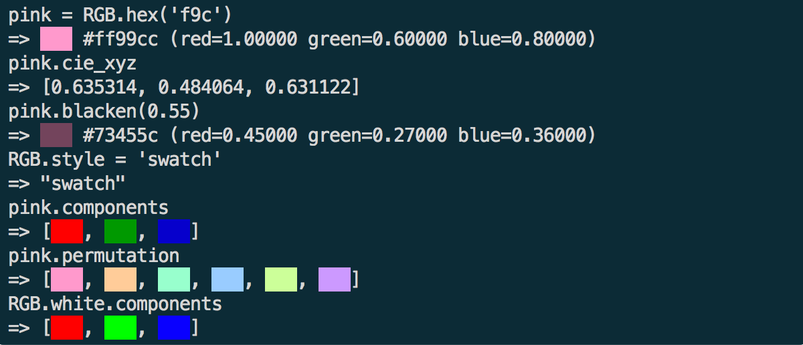

[GitHub](https://github.com/lllisteu/redgreenblue) • [RubyGems](https://rubygems.org/gems/redgreenblue) • [Documentation](https://www.rubydoc.info/gems/redgreenblue/RGB) • [History](History.md)

# redgreenblue

redgreenblue is a simple [Ruby](https://www.ruby-lang.org/) library for handling [RGB colors](https://en.wikipedia.org/wiki/RGB_color_model).

It lets you express RGB colors as 24-bit triplets, 48-bit triplets, fractions, or hexadecimal notation, as well as [HSL, HSB, or HSV](https://en.wikipedia.org/wiki/HSL_and_HSV) (hue, saturation, and lightness, brightness, or value), and has 148 named CSS colors built-in.



 redgreenblue can output RGB colors as [CIE](https://en.wikipedia.org/wiki/CIE_1931_color_space) XYZ or xyY coordinates, L\*a\*b\*, L\*u\*v\*, and their cylindrical representations LCHab and LCHuv.

If your terminal supports "[true color](https://gist.github.com/XVilka/8346728)", redgreenblue's colorised inspect styles will display your colors in 24-bit splendour, right in the terminal.

redgreenblue can create 1-pixel GIF's from any color and also understands some more exotic formats, such as 16-bit RGB565 and 24-bit BGR. On a Mac it can interact with the system color picker.

## Installing

redgreenblue is [available as a gem](https://rubygems.org/gems/redgreenblue). You can simply install it with:

```bash
gem install redgreenblue
```

redgreenblue has no dependencies outside the Ruby Standard Library, and works with Ruby 2.2 or newer.

## Quick start

The core of redgreenblue is the __RGB class__. Each instance of the RGB class holds a color. Internally, these instances, RGB objects, store the amounts of red, green, and blue which make up the color.

Let's try:

```
require 'redgreenblue'
=> true
pink = RGB.hex('ff99cc')
=> RGB #ff99cc (red=1.00000 green=0.60000 blue=0.80000)
```

There are many ways to create RGB objects (or simply _colors_).

Here are six examples that will create the exact same color:

```
pink = RGB.new(1, 0.6, 0.8)
pink = RGB.rgb(255, 153, 204)
pink = RGB.rrggbb(65535, 39321, 52428)
pink = RGB.hex('f9c')
pink = RGB.hsl(330, 1, 0.8)
pink = RGB.hsv(330, 0.4, 1)
```

Now that we have a color stored in an RGB object, it can supply several pieces of information about itself:

```
pink.values
=> [1.0, 0.6, 0.8]
pink.red
=> 1.0
pink.rgb
=> [255, 153, 204]
pink.g
=> 153
pink.rrggbb
=> [65535, 39321, 52428]
pink.bb
=> 52428
pink.hsl
=> [330.0, 1.0, 0.8]
pink.hsb
=> [330.0, 0.4, 1.0]
pink.xyz
=> [0.635314, 0.484064, 0.631122]
pink.hex
=> "ff99cc"
pink.hex(true)
=> "f9c"
```

Altering colors is easy:

```
rose = RGB.red
=> RGB #ff0000 (red=1.00000 green=0.00000 blue=0.00000)
rose.whiten!(0.6)
=> RGB #ff9999 (red=1.00000 green=0.60000 blue=0.60000)
rose.bb = 52428
=> 52428
rose
=> RGB #ff99cc (red=1.00000 green=0.60000 blue=0.80000)
pink == rose
=> true
```

## Resources

* [HSL and HSV](https://en.wikipedia.org/wiki/HSL_and_HSV) on Wikipedia
* [_Photoshop by the Numbers: Color Coding_](https://geraldbakker.nl/psnumbers/color-coding/index.html), by Gerald Bakker
* _Das ABC der Farbe_, by Markus Wäger (2017), ISBN 978-3-8362-4501-2
* [Bruce Lindbloom](http://www.brucelindbloom.com/)
* [_CIE 15: Technical Report: Colorimetry, 3rd edition_](https://archive.org/details/gov.law.cie.15.2004) (2004)
* [_A Guided Tour of Color Space_](http://poynton.ca/PDFs/Guided_tour.pdf) (PDF), by [Charles Poynton](http://poynton.ca/) (1997)
* _Color for the Sciences_, by Jan Koenderink (2010), ISBN 978-0-262-01428-1
* _Color Ordered_, by Rolf Kuehni and Andreas Schwarz (2008), ISBN 978-0-19-518968-1
* _Psychology_, by Henry Gleitman, James Gross, Daniel Reisberg (2010), ISBN 978-0-393-93250-8
* _Interaction of Color_, by Josef Albers (1963), ISBN 978-0-300-17935-4
* _配色事典 – A Dictionary of Color Combinations_, by Sanzo Wada (2010), ISBN 978-4-86152-247-5
* _The Anatomy of Colour_, by Patrick Baty (2017), ISBN 978-0-500-51933-2

## Credits

Apart from the resources listed above, some discussions and answers on [Stack Overflow](https://stackoverflow.com) and [PerlMonks](https://www.perlmonks.org) were very helpful, as were some articles on [Wikipedia](https://en.wikipedia.org/). Many helpful sources of information are credited where applicable in the source code, often with a link.

Gamma- and CIE-processing in redgreenblue lean heavily on work by [Bruce Lindbloom](http://www.brucelindbloom.com/).

## License

See the included [LICENSE.txt](LICENSE.txt) file.

## Alternatives

[Color](https://github.com/halostatue/color): a versatile Ruby color library.

-----

<p align=center>
“The philosopher for whom rainbows can be explained away never saw them.”
</p>

<p align=center>
Henry David Thoreau, <i>Journal</i>, 5 November 1857.
</p>

